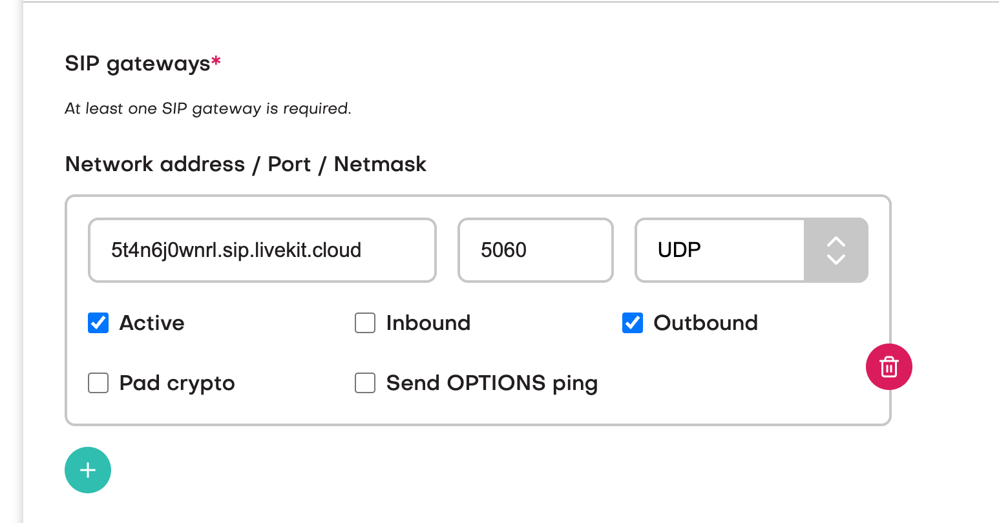
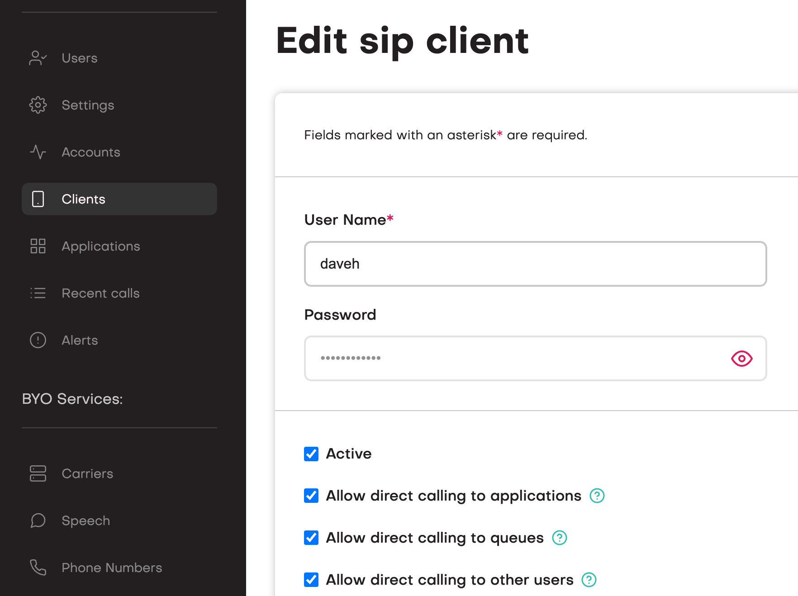
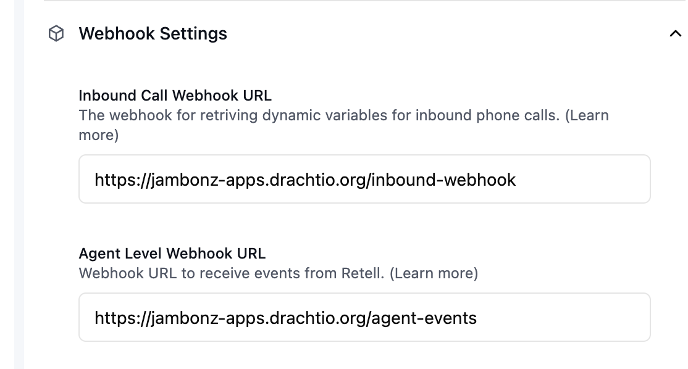

# retell-sip-integration-example

This is a [jambonz](https://jambonz.org) [application](https://www.jambonz.org/docs/webhooks/overview/) that allows Retell AI users to connect their agents to any SIP trunking provider or PBX.

For those of you not familiar with jambonz, it is an open source (MIT-licensed) voice gateway for CPaaS, CX/AI, and Voice/AI which is the functional equivalent of Twilio with the added ability to self-host on your own infrastructure or use our cloud service at [jambonz.cloud](https://jambonz.cloud)).  It has several advantages over Twilio:

- more cost-effective: Twilio's per-minute rounding and surcharges for using features like their voice sdk and bidirectional streaming can be eliminated, and jambonz provides all the same features (and more)
- you can bring your own carrier (jambonz has integrated with hundreds of SIP providers and PBXs)
- run awaywhere: jambonz can run in your cloud, on prem, or you can use our hosted service

jambonz also provides value-added features that you can make use of, such as answering machine detection and playing entry prompts and the like that may be more cost effective to do before connecting calls to the LLM.


Deploy this application to your Heroku account with just a few clicks.

[](https://www.heroku.com/deploy?template=[https://github.com/heroku/node-js-getting-started](https://github.com/jambonz/retell-sip-integration-example)

## Installing

Having checked out this repo, do the usual:
```bash
npm ci
```

## Configuration

Retell provides two methods of custom telephony integration, and this application supports both:
- [Method 1: Elastic SIP Trunking](https://docs.retellai.com/make-calls/custom-telephony#method-1-elastic-sip-trunking-recommended).  This is the method recommended by Retell, and is the default behavior for this application.
- [Method 2: Dial to SIP Endpoint](https://docs.retellai.com/make-calls/custom-telephony#method-2-dial-to-sip-endpoint).  This method can alternatively be used, but one of the drawbacks of this method is that the built-in call transfer function that Retell provides will not work with it because Retell will not send a REFER when this method is used.

> Note: you can still implement call transfer when using method 2 by creating your own user function that instructs jambonz to transfer the call.

## Inbound calls
To use this application with an inbound call simply configure your jambonz system to route incoming calls to this application. The application will then connect the incoming call to your Retell agent.

### using Method 1 (Preferred)
In order to use Method 1 (Elastic SIP trunking) you have to create a "Carrier" in jambonz that points to Retell.  This carrier will have one outbound gateway and no inbound gateways since we are only sending calls to Retell and not receiving them.  (Outbound calls are placed using jambonz REST API and then we connect them to Retell once the user has answered, so it still looks like an inbound call to Retell).

##### Configuring jambonz
So log into the jambonz portal and create a Carrier named 'Retell'.  Check the box for E.164 syntax, uncheck outbound authentication, and then add one SIP gateway with their network address of `5t4n6j0wnrl.sip.livekit.cloud`.



Next, add a SIP client credential.  Click on "Clients" and add a sip client with a name and password.




#### Configuring Retell
With method 1, Retell calls an inbound call webhook to get dynamic variables for the call.  This application provides an endpoint for an HTTP POST at [/inbound-webhook](./lib/webhooks/endpoints/inbound-webhook.js), so log into the Retell console and add this webhook.



> Note: change the DNS name to that of your websocket server

You'll note that this application also provides a webhook to receive agent events from Retell.  Currently [these are simply logged](./lib/webhooks/endpoints/agent-events.js) for informational purposes, but you may want to use this information in your application.

Finally, you need to add the phone number that you are receiving calls on from your SIP trunking/DID provider in the Retell console. In the Retell Dashboard, select "Phone Numbers" and click the plus sign.  In the dropdown select "Connect to your number via SIP trunking".
- Add the phone number in E.164 format (ie leading + followed by country code)
- For termination URI enter a URI with the 'sip' scheme and the DNS of your sip realm in jambonz (you can find that under the Account tab), e.g. 'sip:mydomain.sip.jambonz.cloud'
- For sip trunk username and password enter the username and password you created above on jambonz.

After creating the phone number, associate it with the Retell agent you want to use.

##### Running the application using Method 1

Now you are ready to test the application.  You must provide your Retell api key and the name of the Retell Carrier that you created on jambonz
```bash
RETELL_API_KEY=xxxxxxxxxx RETELL_TRUNK_NAME=Retell node app.js
``` 

### Using Method 2
If instead you wish to use method 2 - Dial to SIP Endpoint you do not need to create a Carrier on jambonz.  No setup is needed on the jambonz side to use this method.  No setup is needed on the Retell side either; you do not need to add a phone number since we wont be dialing to a phone number, instead we will be calling the [Register Call](https://docs.retellai.com/api-references/register-call) api.

To run using method 2, you need to specify your Retell api key and agent id.
```bash
RETELL_API_KEY=xxxxxxxxxxxxxx RETELL_AGENT_ID=agent_yyyyyyyyy node app.js
```

## Outbound calls

### Outbound calls option 1: from Retell (Preferred)
You can place the outbound call from Retell to jambonz and have jambonz forward the call on to your carrier.  To use this method you must do the following:

- Add a sip credential in jambonz as described earlier.  If you have already added a credential for this you can use that but please note: the sip credential must **only** be used to authenticate calls from Retell.  Do not give it out or use it for other sip devices.
- Make sure you have added a Carrier on jambonz that you want to use to complete the call, [as described here](https://blog.jambonz.org/using-jambonz-for-retell-custom-telephony#heading-on-jambonz-add-a-carriersip-trunk-for-your-pstn-provider).
- Add your phone number on Retell, selecting "Connect to your number via SIP trunking" and add the phone number, your sip realm value on jambonz (e.g. "mydomain.sip.jambonz.cloud") as the termination uri, and the sip credential username and password from above.
- Finally, **and this is important** go into the jambonz portal and on the Accounts page set the dropdown for `Application for SIP device calls` to this application.  (The reason for this is that calls coming from Livekit/Retell are authenticated based on sip credentials since Livekit does not provide static IPs for whitelisting).

When you run the application, start it as follows supplying the `PSTN_TRUNK_NAME` environment variable that refers to the name you assiged to your PSTN Carrier in jambonz as well `RETELL_SIP_CLIENT_USERNAME` which should have the sip credential username that you created on jambonz (the same value you added into Retell when configuring a number in the "SIP Trunk User Name" field of the "Connect to your number via SIP trunking" dialog).

```bash
RETELL_API_KEY=xxxxxxxxxx \
RETELL_TRUNK_NAME=Retell \
PSTN_TRUNK_NAME=myCarrier \
RETELL_SIP_CLIENT_USERNAME=retell \
node app.js
```

Now, when an incoming call arrives from Retell it will be sent out your PSTN provider.  Conversely, when an incoming call arrives from the PSTN it will be connected to Retell.

### Outbound calls option 2: from jambonz
To use this application for making outbound calls from jambonz and then connecting the called party to Retel, use the [jambonz REST API](https://api.jambonz.org/#243a2edd-7999-41db-bd0d-08082bbab401) to create a new call.  To do this you will need to know:

- your jambonz account_sid
- your jambonz api key
- the application_sid of this application (available once you Add Application in jambonz)
- the base URL of the jambonz system you are using (https://api.jambonz.cloud for example on jambonz.cloud)

You can then format and send an HTTP POST to jambonz like this:

```bash
curl --location -g 'https:/{{baseUrl}}/v1/Accounts/{{account_sid}}/Calls' \
--header 'Authorization: Bearer {{api_key}}' \
--header 'Content-Type: application/json' \
--data '{
    "application_sid": "{{application_sid}}",
    "from": "15083728299",
    "to": {
        "type": "phone",
        "number": "15082084809"
    }
}'
```

Of course, substitute in your own from and to phone numbers.  The example above assumes that you have created a BYOC trunk on jambonz that you will use to outdial the user.

## I'm new to jambonz and I need more help!

Got you covered.  Easiest way to get started is to [create a free trial account on jambonz.cloud](https://jambonz.cloud/register).  Once you have an account, add a Carrier for your chosen SIP trunking provider.  Then add an Application that contains the websocket endpoint that this application exposes.  The URL of the application should be `wss://your.specific.domain/retell`.  In other words, just make sure the protocol is wss and the path is /retell, the host part will be wherever you host this application.  

>> And note that you can always use [ngrok](https://ngrok.com/) to run the application locally on your laptop for testing!

Then add a phone number from your Carrier and connect it to the Application, and you are set to go.  When you dial that number the call will be handled by your application, which will forward it on to your Retell agent.

## I have more questions!
Join our Slack channel by going to https://joinslack/jambonz.org.
